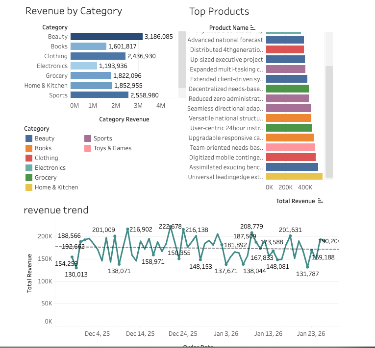

# 🛒 E-Commerce Real-Time Analytics Pipeline

> **A production-grade serverless data engineering project on AWS.**  
> Processes 30k+ records/day for under $2/month using 100% Infrastructure-as-Code.

[](https://aws.amazon.com)
[](https://www.terraform.io/)
[](https://www.python.org/)
[](LICENSE)
[](cost_analysis.md)

---

## ⚡️ Quick Look

**The Problem:** E-commerce businesses need real-time insights into sales trends, inventory levels, and customer behavior to make data-driven decisions.

**The Solution:** A scalable, serverless data pipeline that ingests, cleans, and analyzes transaction data automatically.

### How It Works

```mermaid
flowchart LR
    GEN[Generate Data] -->|JSON| ING[Ingest (Lambda)]
    ING -->|Raw| S3_B[S3 Bronze]
    S3_B -->|Trigger| ETL[ETL (Glue)]
    ETL -->|Clean| S3_S[S3 Silver]
    S3_S -->|Agg| S3_G[S3 Gold]
    S3_G -->|Query| ATH[Athena]
    ATH -->|Visualize| DASH[Dashboard]
```

---

## 🏗️ Architecture

This project uses a **Medallion Architecture** (Bronze/Silver/Gold) to ensure data quality and accessibility.

```mermaid
graph TD
    subgraph "Source System"
        Gen[Python Data Generator]
    end

    subgraph "Ingestion Layer"
        Lambda[AWS Lambda]
        CW[CloudWatch Logs]
    end

    subgraph "Data Lake (S3)"
        Bronze[🥉 Bronze (Raw)]
        Silver[🥈 Silver (Cleaned)]
        Gold[🥇 Gold (Aggregated)]
    end

    subgraph "Processing Layer"
        Glue[AWS Glue ETL]
        Crawler[Glue Crawler]
    end

    subgraph "Serving Layer"
        Athena[AWS Athena]
        Quicksight[Visualization]
    end

    Gen -->|API / S3 Upload| Lambda
    Lambda -->|Validation| Bronze
    
    Bronze -->|Trigger| Glue
    Glue -->|Transform| Silver
    Silver -->|Aggregate| Gold
    
    Crawler -->|Catalog| Bronze
    Crawler -->|Catalog| Silver
    Crawler -->|Catalog| Gold
    
    Gold -->|SQL| Athena
    Athena -->|Source| Quicksight
```

### Infrastructure Components

| Component | Service | Role | Cost Tier |
|-----------|---------|------|-----------|
| **Ingestion** | AWS Lambda | Serverless entry point for data | Free Tier |
| **Storage** | Amazon S3 | Data Lake storage (Bronze/Silver/Gold) | Free Tier (5GB) |
| **ETL** | AWS Glue | Data cleaning and transformation | Pay-per-use |
| **Catalog** | Glue Data Catalog | Metadata management | Free (1M reqs) |
| **Analytics** | Amazon Athena | Serverless SQL queries | $5/TB scanned |
| **Orchestration** | Apache Airflow | Workflow automation | Open Source |

---

## 📂 Project Structure

```bash
ecommerce-realtime-analytics-pipeline/
├── 🏗️ terraform/              # Infrastructure as Code
│   ├── modules/               # Reusable Terraform modules
│   └── main.tf                # Main cloud resource definition
│
├── 🐍 src/                    # Application Code
│   ├── analytics/             # SQL queries for analysis
│   ├── data_generation/       # Python scripts to mimic user traffic
│   ├── ingestion/             # Lambda functions for data entry
│   ├── monitoring/            # CloudWatch and alerting scripts
│   ├── orchestration/         # Airflow DAGs
│   ├── processing/            # Glue/Spark ETL jobs
│   ├── utils/                 # Shared helper functions
│   └── warehouse/             # DDLs for data warehousing
│
├── 🧪 tests/                  # Unit and Integration tests
├── 📊 dashboards/             # Tableau/Quicksight definitions
├── 📚 docs/                   # Detailed documentation
└── ⚙️ scripts/                 # Utility shell scripts
```

---

## 🚀 Quick Start

Get the pipeline running in under 15 minutes.

### 1. Prerequisites
- **AWS Account** with admin access.
- **Terraform** (v1.6+) installed.
- **Python** (v3.9+) installed.
- **AWS CLI** configured (`aws configure`).

### 2. Deploy Infrastructure
Initialize and apply the Terraform configuration to build the AWS environment.

```bash
cd terraform
terraform init
terraform apply -auto-approve
```

> **Note:** This creates S3 buckets, Lambda functions, and Glue jobs. It will output the names of created resources.

### 3. Generate & Ingest Data
Run the generator script to simulate e-commerce traffic.

```bash
# Install dependencies
pip install -r requirements.txt

# Generate fake order data
python src/data_generation/generate_data.py --records 1000

# Triggers the ingestion pipeline automatically via S3 upload
```

### 4. Analyze Results
Once data is processed (check AWS Glue console for job status), query it via Athena.

```sql
-- Example: Get total revenue by category
SELECT category, SUM(amount) as total_revenue
FROM "ecommerce_analytics_db"."gold_daily_sales"
GROUP BY category
ORDER BY total_revenue DESC;
```

---

## 📊 Analytics & Insights

The pipeline enables answers to critical business questions:

*   **Sales Performance:** Which products are driving the most revenue?
*   **Customer Lifetime Value:** Who are the top 10% of customers?
*   **Inventory Management:** Which items are low in stock vs. demand?

### Sample Dashboard


---

## 🛠️ Technical Highlights

- **Infrastructure as Code:** Entire stack defined in Terraform for reproducibility.
- **Data Quality:** Validation checks at ingestion (schema enforcement) and processing (null checks) stages.
- **Cost Optimization:** Uses S3 Lifecycle policies and Parquet compression to minimize storage costs.
- **CI/CD:** GitHub Actions workflows for linting, testing, and applying Terraform.

## 📖 Documentation

*   [Setup Guide](docs/setup_guide.md) - Detailed installation instructions.
*   [Architecture Decisions](docs/architecture.md) - Why we chose these tools.
*   [Data Catalog](docs/data_catalog.md) - Database schema and dict.
*   [Troubleshooting](docs/troubleshooting.md) - Common errors and fixes.
*   [Cost Analysis](cost_analysis.md) - How we keep it cheap.

---

## 🧪 Testing

Run the test suite to ensure pipeline integrity.

```bash
# Run unit tests
pytest tests/unit

# Run specific integration tests
pytest tests/integration/test_pipeline_flow.py
```

---

## 📬 Contact

**Aung Sett Paing**  
Data Engineer | Cloud Enthusiast

[](https://www.linkedin.com/in/toaungsettpaing/)

---

_If you found this project helpful, please give it a ⭐️!_