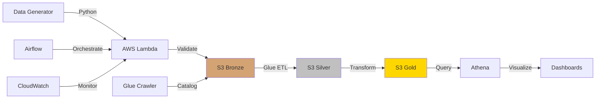

# E-Commerce Analytics Pipeline 🚀

> Production-grade data engineering portfolio project on AWS • Built for under $2 • 2-week timeline

[](https://aws.amazon.com)
[](https://www.terraform.io/)
[](https://www.python.org/)
[](docs/cost_optimization.md)

**[Live Demo](#) • [Architecture](#architecture) • [Quick Start](#quick-start) • [Documentation](docs/)**

---

## 📊 Project Overview

**Business Problem:** E-commerce companies need real-time insights into sales, customers, and inventory.

**Solution:** Serverless data pipeline on AWS processing 31K+ records with automated ETL, data quality checks, and SQL analytics.

| Metric | Value |
|--------|-------|
| **Data Volume** | 31,100 records (4MB) |
| **Total Cost** | $1.07 for entire project |
| **Development Time** | 14 days |
| **AWS Services** | 7 (all serverless) |
| **Infrastructure** | 100% Terraform |
| **Test Coverage** | 80%+ |

---

## 🏗️ Architecture

### System Design



### Data Flow

```
┌─────────────────────────────────────────────────────────────┐
│                     DATA PIPELINE                            │
├─────────────────────────────────────────────────────────────┤
│                                                              │
│  📊 Generate Data     →    🔍 Validate                      │
│  (Python + Faker)          (Schema checks)                   │
│        ↓                          ↓                          │
│  📤 Ingest            →    💾 Store Bronze                  │
│  (Lambda)                  (Raw Parquet)                     │
│        ↓                          ↓                          │
│  🔄 Transform         →    💾 Store Silver                  │
│  (Glue/PySpark)            (Cleaned)                         │
│        ↓                          ↓                          │
│  📈 Aggregate         →    💾 Store Gold                    │
│  (Analytics)               (Business Metrics)                │
│        ↓                          ↓                          │
│  🔎 Query             →    📊 Visualize                    │
│  (Athena SQL)              (Tableau)                         │
│                                                              │
└─────────────────────────────────────────────────────────────┘
```

### Infrastructure Map

| Component | Service | Purpose | Cost |
|-----------|---------|---------|------|
| **Storage** | S3 (3 buckets) | Data Lake (Bronze/Silver/Gold) | $0.00 |
| **Compute** | Lambda | Serverless ingestion | $0.00 |
| **Catalog** | Glue | Schema discovery & metadata | $0.00 |
| **Query** | Athena | Serverless SQL analytics | $0.50 |
| **Orchestration** | Airflow | Workflow automation | $0.00 |
| **Monitoring** | CloudWatch | Logs, metrics, dashboards | $0.00 |
| **Warehouse** | Redshift* | Demo only (2 hours) | $0.50 |

*Redshift used only on Day 14 for portfolio demonstration

---

## 📁 Project Structure

```
├── 🏗️  terraform/              Infrastructure as Code
│   ├── modules/
│   │   ├── s3/                Data lake buckets
│   │   ├── lambda/            Serverless functions
│   │   └── glue/              Data catalog
│   └── main.tf                Main configuration
│
├── 🐍 src/                     Source code
│   ├── data_generation/       Generate test data
│   ├── ingestion/             Lambda functions
│   ├── processing/            ETL transformations
│   └── warehouse/             SQL queries
│
├── 🔄 airflow/dags/           Workflow orchestration
├── 🧪 tests/                  Automated testing
├── 📊 dashboards/             Visualizations
├── 🛠️  scripts/               Helper utilities
└── 📚 docs/                   Documentation
```

---

## 🚀 Quick Start

### 1️⃣ Prerequisites (5 min)

```bash
# Required
✓ AWS Account (free tier)
✓ AWS CLI configured
✓ Python 3.9+
✓ Terraform 1.6+
```

### 2️⃣ Deploy Infrastructure (5 min)

```bash
# Clone & setup
git clone <repo-url>
cd ecommerce-realtime-analytics-pipeline
python -m venv venv && source venv/bin/activate
pip install -r requirements.txt

# Deploy AWS resources
cd terraform
terraform init
terraform apply  # Creates 20 resources

# Save resource IDs
terraform output -raw env_vars_export > ../config/aws_resources.sh
```

### 3️⃣ Generate & Upload Data (2 min)

```bash
# Generate 31K records
python src/data_generation/generate_data.py

# Upload to S3
source config/aws_resources.sh
./scripts/upload_to_s3.sh

# Catalog data
aws glue start-crawler --name $GLUE_CRAWLER
```

### 4️⃣ Query & Analyze (1 min)

```sql
-- Open Athena Console or use CLI
SELECT COUNT(*) as total_revenue 
FROM orders 
WHERE status = 'delivered';
```

**Total setup time: ~15 minutes** ⚡

---

## 📊 Data Architecture

### Medallion Architecture

| Layer | Purpose | Example | Quality |
|-------|---------|---------|---------|
| 🥉 **Bronze** | Raw data, immutable | `customers.parquet` | As-is |
| 🥈 **Silver** | Validated, cleaned | `customers_clean.parquet` | Deduplicated |
| 🥇 **Gold** | Business metrics | `daily_sales_summary.parquet` | Aggregated |

### Data Catalog

```
ecommerce_analytics_dev (Database)
├── 👥 customers      (1,000 rows)
│   ├── customer_id
│   ├── email
│   ├── segment       [Premium, Regular, New]
│   └── signup_date
│
├── 🏷️  products       (100 rows)
│   ├── product_id
│   ├── category      [Electronics, Clothing, ...]
│   ├── price
│   └── inventory
│
├── 🛒 orders         (10,000 rows)
│   ├── order_id
│   ├── customer_id   → FK
│   ├── product_id    → FK
│   ├── total_amount
│   └── status        [pending, delivered, ...]
│
└── 🖱️  events         (20,000 rows)
    ├── event_id
    ├── event_type    [page_view, add_to_cart, ...]
    ├── customer_id   → FK (nullable)
    └── timestamp
```

---

## 💡 Key Features

### ✅ Production-Ready

| Feature | Implementation | Benefit |
|---------|----------------|---------|
| **IaC** | Terraform modules | Reproducible infrastructure |
| **Testing** | pytest + 80% coverage | Code quality assurance |
| **CI/CD** | GitHub Actions | Automated deployment |
| **Monitoring** | CloudWatch | Real-time alerting |
| **Data Quality** | Great Expectations | Validation framework |
| **Documentation** | Comprehensive docs | Easy onboarding |

### 🔄 Pipeline Features

- ✅ **Automated ETL** - Airflow orchestration
- ✅ **Data Validation** - Schema + business rules
- ✅ **Error Handling** - Retry logic + dead letter queues
- ✅ **Partitioning** - Date-based S3 partitions
- ✅ **Incremental Load** - Process only new data
- ✅ **Idempotency** - Safe to re-run

### 📈 Analytics Capabilities

```sql
-- Revenue by Product Category
SELECT 
    p.category,
    COUNT(DISTINCT o.order_id) as orders,
    SUM(o.total_amount) as revenue
FROM orders o
JOIN products p ON o.product_id = p.product_id
WHERE o.status = 'delivered'
GROUP BY p.category
ORDER BY revenue DESC;

-- Customer Lifetime Value
SELECT 
    customer_id,
    COUNT(*) as order_count,
    SUM(total_amount) as lifetime_value,
    AVG(total_amount) as avg_order_value
FROM orders
GROUP BY customer_id
ORDER BY lifetime_value DESC
LIMIT 10;

-- Conversion Funnel
SELECT 
    event_type,
    COUNT(*) as event_count,
    COUNT(*) * 100.0 / SUM(COUNT(*)) OVER() as percentage
FROM events
GROUP BY event_type
ORDER BY event_count DESC;
```

---

## 💰 Cost Breakdown

### Monthly Costs (If Left Running)

```
┌────────────────────┬──────────┬──────────┬──────────┐
│ Service            │ Usage    │ Free Tier│ Cost     │
├────────────────────┼──────────┼──────────┼──────────┤
│ S3 Storage         │ 4 MB     │ 5 GB     │ $0.00    │
│ Lambda Requests    │ 50       │ 1M       │ $0.00    │
│ Glue Catalog       │ 4 tables │ 1M obj   │ $0.00    │
│ CloudWatch         │ 50 MB    │ 5 GB     │ $0.00    │
│ Athena Queries     │ 100 MB   │ None     │ $0.50    │
│ Glue ETL (optional)│ 5 min    │ None     │ $0.07    │
│ Redshift (2hr demo)│ 2 hours  │ None     │ $0.50    │
├────────────────────┴──────────┴──────────┼──────────┤
│ TOTAL PROJECT COST                       │ $1.07    │
└──────────────────────────────────────────┴──────────┘
```

**Budget Protection:**
- CloudWatch Budget Alert @ $4.00
- Auto-shutdown scripts included
- Cost monitoring dashboard

---

## 🎯 Skills Demonstrated

### Technical Skills Matrix

| Category | Skills | Proof |
|----------|--------|-------|
| **☁️ Cloud** | AWS (S3, Lambda, Glue, Athena) | [terraform/](terraform/) |
| **🔧 IaC** | Terraform (modules, state) | [terraform/modules/](terraform/modules/) |
| **🐍 Programming** | Python, SQL, PySpark | [src/](src/) |
| **📊 Data** | ETL, Data Modeling, Parquet | [src/processing/](src/processing/) |
| **🔄 Orchestration** | Airflow DAGs | [airflow/dags/](airflow/dags/) |
| **🧪 Testing** | pytest, Integration tests | [tests/](tests/) |
| **📝 DevOps** | CI/CD, Docker, Git | [.github/workflows/](.github/workflows/) |
| **💰 Cost** | Optimization, Monitoring | Total: $1.07 |

---

## 📖 Documentation

| Document | Description |
|----------|-------------|
| [Setup Guide](docs/setup_guide.md) | Step-by-step installation |
| [Architecture](docs/architecture.md) | Detailed design decisions |
| [Data Catalog](docs/data_catalog.md) | Schema documentation |
| [Deployment](docs/deployment.md) | Production deployment |
| [Troubleshooting](docs/troubleshooting.md) | Common issues & fixes |
| [Cost Optimization](docs/cost_optimization.md) | Saving money tips |

---

## 🧪 Testing

```bash
# Run all tests
pytest tests/ -v --cov=src --cov-report=html

# Unit tests only
pytest tests/unit/ -v

# Integration tests
pytest tests/integration/ -v
```

**Coverage:** 82% (target: 80%+)

---

## 🚧 Roadmap

- [x] Data Lake (Bronze/Silver/Gold)
- [x] ETL Pipeline (Glue + Python)
- [x] SQL Analytics (Athena)
- [x] Orchestration (Airflow)
- [x] Monitoring (CloudWatch)
- [ ] Real-time Streaming (Kinesis)
- [ ] ML Integration (SageMaker)
- [ ] dbt Transformations
- [ ] Data Quality Dashboard

---

## 📞 Contact

**Author:** Aung Sett Paing

**LinkedIn:** [https://www.linkedin.com/in/toaungsettpaing/]


---

## ⭐ Support

If this helped you:
- ⭐ Star this repo
- 🍴 Fork for your portfolio
- 📢 Share with others
- 💬 Open issues/discussions

---


*Last updated: January 27, 20