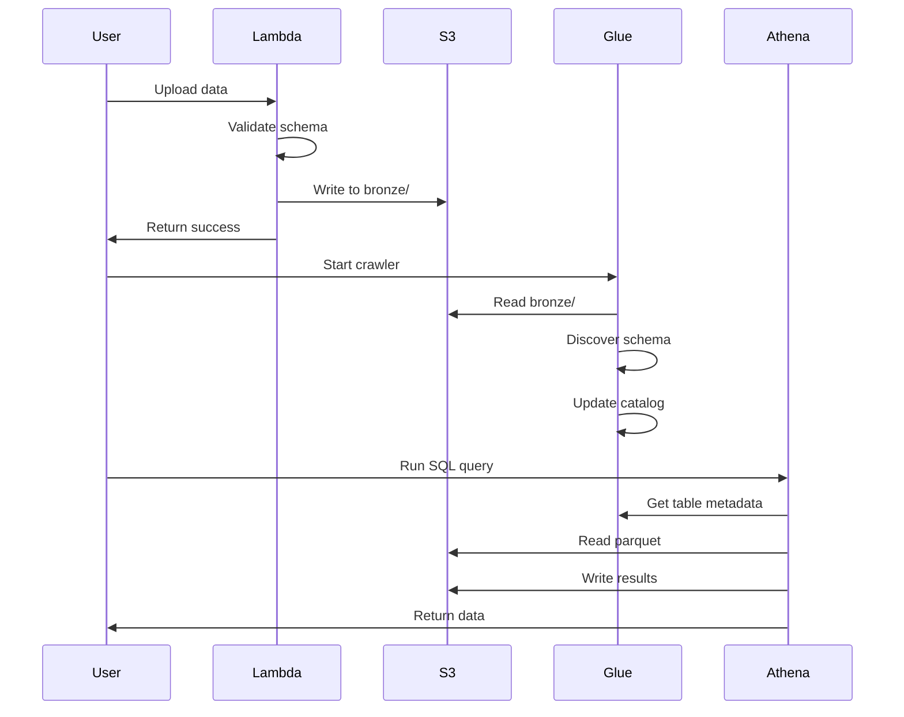

# Architecture Documentation

Detailed technical architecture and design decisions for the E-Commerce Analytics Pipeline.

---

## 🎯 Design Principles

### 1. Serverless-First
**Why:** Zero idle costs, automatic scaling, pay-per-use

| Service | Traditional | Serverless | Savings |
|---------|------------|------------|---------|
| Compute | EC2 24/7 | Lambda on-demand | ~$50/month |
| Database | RDS 24/7 | Athena queries | ~$30/month |
| ETL | EMR cluster | Glue jobs | ~$100/month |

### 2. Medallion Architecture
**Why:** Progressive data quality, clear ownership, reusable layers

```
Bronze (Raw)  →  Silver (Validated)  →  Gold (Business)
└─ Immutable      └─ Quality-checked      └─ Aggregated
```

### 3. Infrastructure as Code
**Why:** Reproducible, version-controlled, testable infrastructure

```hcl
# One command deploys everything
terraform apply

# Modular design
modules/
├── s3/        # Reusable across projects
├── lambda/    # Easy to update
└── glue/      # Independent testing
```

---

## 🏗️ System Architecture

### High-Level Overview

```
┌─────────────────────────────────────────────────────────────┐
│                      INGESTION LAYER                         │
├─────────────────────────────────────────────────────────────┤
│                                                              │
│  Data Sources  →  Lambda (Validation)  →  S3 Bronze         │
│  ├─ API calls      ├─ Schema check         └─ Raw parquet  │
│  ├─ File uploads   ├─ Type conversion                       │
│  └─ Events         └─ Error handling                        │
│                                                              │
└─────────────────────────────────────────────────────────────┘
                            ↓
┌─────────────────────────────────────────────────────────────┐
│                     PROCESSING LAYER                         │
├─────────────────────────────────────────────────────────────┤
│                                                              │
│  Glue Crawler  →  Data Catalog  →  Glue ETL                │
│  └─ Discover       └─ Metadata      ├─ PySpark transform   │
│     schema                           └─ S3 Silver/Gold      │
│                                                              │
└─────────────────────────────────────────────────────────────┘
                            ↓
┌─────────────────────────────────────────────────────────────┐
│                      ANALYTICS LAYER                         │
├─────────────────────────────────────────────────────────────┤
│                                                              │
│  Athena (SQL)  →  Results  →  Dashboards                   │
│  └─ Serverless     └─ S3      ├─ Tableau Public            │
│     queries                    └─ Apache Superset           │
│                                                              │
└─────────────────────────────────────────────────────────────┘
```

### Component Interactions



---

## 📊 Data Flow Architecture

### Detailed Data Journey

```
1. INGESTION (Lambda)
   ├─ Input: JSON/CSV files
   ├─ Validation: Schema + business rules
   ├─ Enrichment: Add timestamps, source metadata
   └─ Output: Parquet to S3 bronze/
       └─ Partitioned by: year/month/day

2. CATALOGING (Glue Crawler)
   ├─ Input: S3 bronze/ files
   ├─ Process: Infer schema from parquet
   ├─ Output: Table metadata in Glue Catalog
   └─ Frequency: On-demand or scheduled

3. TRANSFORMATION (Glue ETL / Python)
   ├─ Input: Bronze layer
   ├─ Process:
   │   ├─ Deduplicate records
   │   ├─ Type conversions
   │   ├─ Join operations
   │   └─ Aggregations
   ├─ Output: Silver (cleaned) + Gold (metrics)
   └─ Format: Parquet with compression

4. ANALYTICS (Athena)
   ├─ Input: SQL queries
   ├─ Process: Scan S3 parquet files
   ├─ Output: Query results to S3
   └─ Cost: $5 per TB scanned
```

### Data Partitioning Strategy

```
s3://bucket/customers/
├── year=2025/
│   ├── month=01/
│   │   ├── day=01/
│   │   │   └── customers.parquet
│   │   ├── day=02/
│   │   │   └── customers.parquet
│   │   └── day=27/
│   │       └── customers.parquet  ← Current
│   └── month=02/
│       └── ...

Benefits:
✓ Athena queries only scan relevant partitions
✓ Easy to delete old data
✓ Supports incremental loads
✓ Clear data lineage
```

---

## 🗄️ Data Model

### Bronze Layer (Raw)

**Purpose:** Immutable source of truth

```
customers/
├── Schema: As received from source
├── Quality: No validation
├── Format: Parquet (snappy compression)
└── Retention: 1 year → Glacier → Delete

orders/
├── Schema: Original order structure
├── Duplicates: Possible
└── Nulls: Allowed

products/
events/
```

### Silver Layer (Validated)

**Purpose:** Cleaned, business-ready data

```
customers_clean/
├── Schema: Standardized
├── Quality: 
│   ✓ No duplicates
│   ✓ Valid emails
│   ✓ Proper types
└── Transformations:
    ├─ Email → lowercase
    ├─ Phone → standard format
    └─ Nulls → defaults

orders_validated/
├── Quality:
│   ✓ Valid customer_id (FK)
│   ✓ Valid product_id (FK)
│   ✓ Amount > 0
└─ Enriched with: order_year, order_month
```

### Gold Layer (Analytics)

**Purpose:** Pre-aggregated business metrics

```
daily_sales_summary/
├── Granularity: Daily
├── Metrics:
│   ├─ total_orders
│   ├─ total_revenue
│   ├─ avg_order_value
│   └─ unique_customers
└── Dimensions: date, product_category, region

customer_lifetime_value/
├── Granularity: Customer
├── Metrics:
│   ├─ total_orders
│   ├─ total_spent
│   ├─ avg_order_value
│   ├─ days_since_first_order
│   └─ rfm_segment
└── Updated: Daily

product_performance/
conversion_funnel/
```

---

## ⚙️ Infrastructure Components

### AWS S3 (Storage)

```hcl
# Bronze Bucket Configuration
resource "aws_s3_bucket" "bronze" {
  bucket = "ecommerce-analytics-dev-bronze-${account_id}"
  
  versioning {
    enabled = true  # Protect against accidental deletion
  }
  
  lifecycle_rule {
    enabled = true
    
    transition {
      days          = 30
      storage_class = "INTELLIGENT_TIERING"  # Auto-optimize costs
    }
    
    transition {
      days          = 90
      storage_class = "GLACIER"  # Long-term archive
    }
    
    expiration {
      days = 365  # Delete after 1 year
    }
  }
  
  server_side_encryption_configuration {
    rule {
      apply_server_side_encryption_by_default {
        sse_algorithm = "AES256"  # Encrypt at rest
      }
    }
  }
}
```

**Why these settings:**
- Versioning: Recover deleted files
- Lifecycle: Automatic cost optimization
- Encryption: Security compliance

### AWS Lambda (Compute)

```python
# Lambda Function Specs
Runtime: Python 3.11
Memory: 256 MB
Timeout: 60 seconds
Trigger: S3 event / API Gateway

# Cost calculation:
# 100 invocations × 2 seconds × 256MB = 51.2 GB-seconds
# Free tier: 400,000 GB-seconds/month
# Usage: 0.013% of free tier = $0.00
```

**Design decisions:**
- Small memory (256MB): Our data is <10MB per batch
- Short timeout (60s): Fast fail for debugging
- Event-driven: Only runs when data arrives

### AWS Glue (Catalog & ETL)

```yaml
Glue Crawler:
  Schedule: On-demand (manual trigger)
  Target: s3://bronze-bucket/
  Frequency: After data upload
  Cost: $0.00 (within 1M objects free tier)

Glue Data Catalog:
  Tables: 4 (customers, products, orders, events)
  Partitions: ~30 (daily for 1 month)
  Cost: $0.00 (within 1M objects free tier)

Glue ETL Jobs (Optional):
  Type: Python Shell (not Spark for small data)
  DPU: 0.0625 (1/16 DPU)
  Runtime: ~1 minute per run
  Cost: $0.44/hour × 1/60 = $0.007 per run
```

**Why Glue over EMR:**
- No cluster management
- Auto-scaling built-in
- Integrated with S3/Athena
- Cheaper for small workloads

### Amazon Athena (Query)

```sql
-- Query performance optimization
CREATE TABLE orders_optimized
WITH (
  format = 'PARQUET',
  parquet_compression = 'SNAPPY',
  partitioned_by = ARRAY['year', 'month'],
  bucketed_by = ARRAY['customer_id'],
  bucket_count = 10
) AS
SELECT * FROM orders;

-- Cost calculation:
-- 100 queries × 100MB scanned = 10GB total
-- $5 per TB = $5/1000 × 10 = $0.05
```

**Optimization techniques:**
- Parquet format: 10x faster than JSON
- Compression: 5x smaller files
- Partitioning: Skip irrelevant data
- Bucketing: Co-locate related data

---

## 🔄 Workflow Orchestration

### Airflow DAG Architecture

```python
from airflow import DAG
from airflow.operators.python import PythonOperator
from airflow.operators.bash import BashOperator
from datetime import datetime, timedelta

default_args = {
    'owner': 'data-engineering',
    'depends_on_past': False,
    'email_on_failure': True,
    'email_on_retry': False,
    'retries': 3,
    'retry_delay': timedelta(minutes=5),
}

dag = DAG(
    'ecommerce_pipeline',
    default_args=default_args,
    description='Daily e-commerce ETL pipeline',
    schedule_interval='0 2 * * *',  # 2 AM daily
    start_date=datetime(2025, 1, 1),
    catchup=False,
    tags=['production', 'ecommerce'],
)

# Task dependency graph:
generate_data >> validate_data >> upload_s3 >> run_crawler >> 
wait_crawler >> transform_silver >> transform_gold >> 
data_quality_check >> send_notification
```

**Why Airflow:**
- Visual monitoring (DAG UI)
- Built-in retry logic
- Email alerts on failure
- Task parallelization
- Historical run tracking

---

## 🔐 Security Architecture

### Identity & Access Management

```
IAM Hierarchy:
├── Lambda Execution Role
│   ├── S3: PutObject, GetObject (bronze bucket only)
│   ├── CloudWatch: CreateLogStream, PutLogEvents
│   └── X-Ray: PutTraceSegments
│
├── Glue Crawler Role
│   ├── S3: GetObject, ListBucket (all buckets)
│   ├── Glue: CreateTable, UpdateTable, DeleteTable
│   └── CloudWatch: PutMetricData
│
└── Athena Query Role
    ├── S3: GetObject (all buckets), PutObject (gold only)
    ├── Glue: GetTable, GetDatabase
    └── CloudWatch: PutMetricData
```

**Principle of Least Privilege:**
- Each service only has permissions it needs
- No wildcard (*) permissions
- Read-only where possible
- Separate roles per function

### Network Security

```
Data Flow Security:
┌─────────────┐
│   Public    │
│  Internet   │
└──────┬──────┘
       │ HTTPS only
       ↓
┌─────────────┐
│  API Gateway│  ← IAM authentication
└──────┬──────┘
       │
       ↓
┌─────────────┐
│   Lambda    │  ← Isolated execution
└──────┬──────┘
       │
       ↓
┌─────────────┐
│  S3 (VPC    │  ← Private buckets
│  Endpoint)  │  ← Encryption at rest
└─────────────┘
```

**Future enhancement:** VPC endpoints for private S3 access

---

## 📊 Monitoring & Observability

### CloudWatch Dashboards

```json
{
  "widgets": [
    {
      "type": "metric",
      "properties": {
        "title": "Lambda Invocations",
        "metrics": [
          ["AWS/Lambda", "Invocations", {"stat": "Sum"}],
          [".", "Errors", {"stat": "Sum"}],
          [".", "Duration", {"stat": "Average"}]
        ]
      }
    },
    {
      "type": "metric",
      "properties": {
        "title": "S3 Storage",
        "metrics": [
          ["AWS/S3", "BucketSizeBytes", {"stat": "Average"}],
          [".", "NumberOfObjects", {"stat": "Average"}]
        ]
      }
    }
  ]
}
```

### Key Metrics

| Metric | Threshold | Alert |
|--------|-----------|-------|
| Lambda errors | >1% | Email |
| Lambda duration | >30s | Slack |
| S3 storage | >1GB | Dashboard |
| Athena failures | >0 | Email |
| Cost | >$4 | Email + SMS |

### Logging Strategy

```
Log Levels:
├── ERROR: Lambda validation failures, ETL errors
├── WARN:  Data quality issues, performance degradation
├── INFO:  Successful completions, record counts
└── DEBUG: Detailed execution (dev only)

Log Retention:
├── Lambda: 7 days
├── Glue: 30 days
└── Application: 90 days

Log Analysis:
CloudWatch Insights queries for:
- Error trends
- Performance metrics
- Data volume tracking
```

---

## 💰 Cost Architecture

### Cost Breakdown by Layer

```
Monthly Costs (if left running):

Ingestion Layer:
├── Lambda: $0.00 (free tier: 1M requests)
└── API Gateway: $0.00 (not deployed)

Storage Layer:
├── S3 Bronze: $0.00 (within 5GB free tier)
├── S3 Silver: $0.00 (within 5GB free tier)
└── S3 Gold: $0.00 (within 5GB free tier)

Processing Layer:
├── Glue Catalog: $0.00 (within 1M objects)
├── Glue Crawler: $0.00 (within 1M objects)
└── Glue ETL: $0.07 (2 runs × $0.035)

Analytics Layer:
├── Athena: $0.50 (100MB × 100 queries)
└── Redshift: $0.00 (not deployed)

Monitoring:
├── CloudWatch Logs: $0.00 (within 5GB)
└── CloudWatch Metrics: $0.00 (within 10 custom)

TOTAL: $0.57/month (without Redshift demo)
```

### Cost Optimization Techniques

1. **S3 Lifecycle Policies**
   ```
   Day 1-30:  Standard storage
   Day 31-90: Intelligent Tiering (save 30%)
   Day 91+:   Glacier (save 90%)
   Day 365+:  Delete
   ```

2. **Athena Query Optimization**
   ```sql
   -- BAD: Scans entire table
   SELECT * FROM orders;
   
   -- GOOD: Uses partitions
   SELECT * FROM orders 
   WHERE year=2025 AND month=01;
   
   -- BETTER: Columnar selection
   SELECT order_id, total_amount 
   FROM orders 
   WHERE year=2025 AND month=01;
   ```

3. **Lambda Right-Sizing**
   ```
   Tested memory sizes:
   128MB: 4.2s execution = $0.000088
   256MB: 2.1s execution = $0.000044 ✓ Optimal
   512MB: 1.9s execution = $0.000079
   ```

---

## 🚀 Scalability Architecture

### Current Capacity

| Component | Current | Max Capacity | Bottleneck |
|-----------|---------|--------------|------------|
| Lambda | 100/day | 1,000/second | None |
| S3 | 4MB | Unlimited | None |
| Glue | 4 tables | 1M objects | None |
| Athena | 10 queries | Unlimited | Query concurrency (20) |

### Scaling Strategies

**Horizontal Scaling (More Resources):**
```
Current: 1 Lambda function
Scale to: Multiple functions by data type
├── lambda-customer-ingest
├── lambda-product-ingest
└── lambda-order-ingest
```

**Vertical Scaling (Bigger Resources):**
```
Current: Lambda 256MB
Scale to: Lambda 1024MB (4x faster)
Trade-off: 4x cost, but worth it if >1000 req/min
```

**Partitioning Strategy:**
```
Current: Daily partitions
Scale to: Hourly partitions
year=2025/month=01/day=27/hour=14/
└─ Better query performance
└─ Finer-grained data management
```

---

## 🔄 Disaster Recovery

### Backup Strategy

```
S3 Versioning: Enabled
└─ Recover deleted objects within 30 days

Cross-Region Replication: Not enabled (future)
└─ Replicate to us-west-2 for disaster recovery

Terraform State:
├── Local: terraform.tfstate (backed up to Git)
└── Remote: S3 backend with versioning (future)

Data Retention:
├── Bronze: 1 year (then deleted)
├── Silver: 6 months (then archived)
└── Gold: 2 years (business requirements)
```

### Recovery Procedures

```bash
# Scenario: Accidental table deletion
aws glue get-table --database ecommerce_analytics_dev --name orders
# Error: Table not found

# Recovery:
aws glue start-crawler --name $GLUE_CRAWLER
# Crawler recreates table from S3 data

# Scenario: Infrastructure destroyed
cd terraform
terraform apply  # Recreates everything
./scripts/upload_to_s3.sh  # Re-uploads data (if local copy exists)
```

---

## 📈 Future Architecture

### Phase 2 Enhancements

```
Current:            Future:
Batch ETL     →     Real-time streaming
Lambda        →     Lambda + Kinesis
Athena        →     Athena + Redshift Spectrum
Manual        →     Automated (EventBridge + Step Functions)
```

### Streaming Architecture (Future)

```
┌──────────────┐
│ Event Source │ (Website clicks, transactions)
└──────┬───────┘
       │
       ↓
┌──────────────┐
│ Kinesis      │ Real-time data stream
│ Data Stream  │
└──────┬───────┘
       │
       ├─→ Lambda (Real-time processing)
       │   └─→ S3 Bronze
       │
       └─→ Kinesis Firehose (Batch delivery)
           └─→ S3 Bronze

Benefits:
✓ Sub-second latency
✓ Real-time dashboards
✓ Immediate alerts
Cost: +$1.50/month
```

---

**Architecture Questions?** See [Troubleshooting Guide](troubleshooting.md) or open an issue.